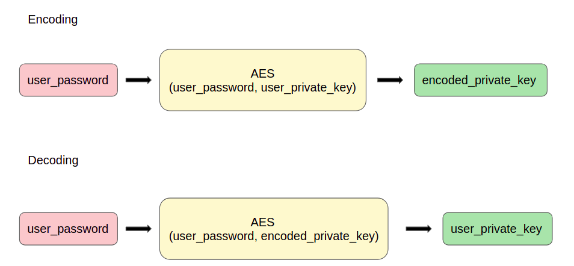
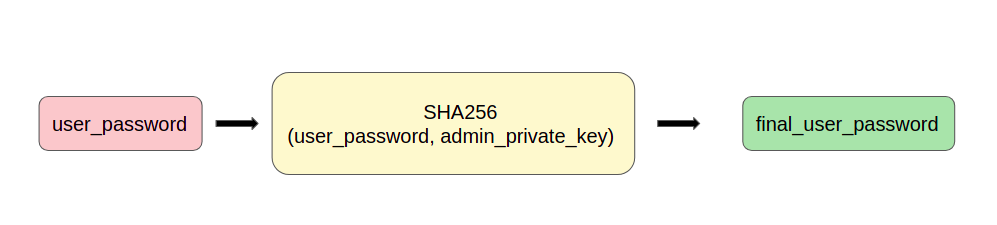
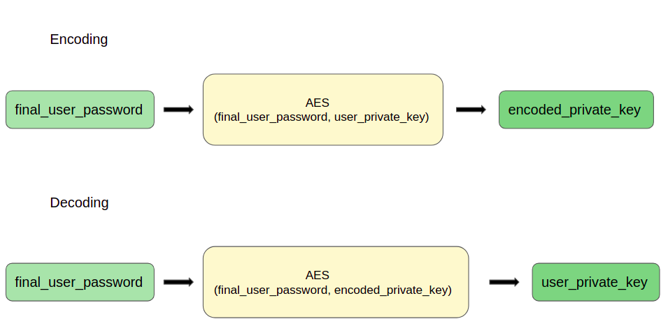

- To develop the custodial wallets, we have utilized the In Memory Signers that Tezos provides to use private keys to sign transactions through backend frameworks.
- As a part of the storing and retrieving the private keys of users, we have designed a 2-level security protocol which uses AES encryption, which is a symmetric block cipher and SHA256, which is an irreversible hashing algorithm. 
  - We initially generate a public key hash and the corresponding private key for each user which together act as a Tezos wallet.
  - Now to store the private key, we first hash the user password with an environment secret to get a digest that act as a stronger version of the existing user password.
  - Then we AES encrypt the digest along with the private key to get the encoded form of the private key which can be stored.
  - Then when required we AES decrypt the encoded version using the same process.

Level 1

Level 2

Final

